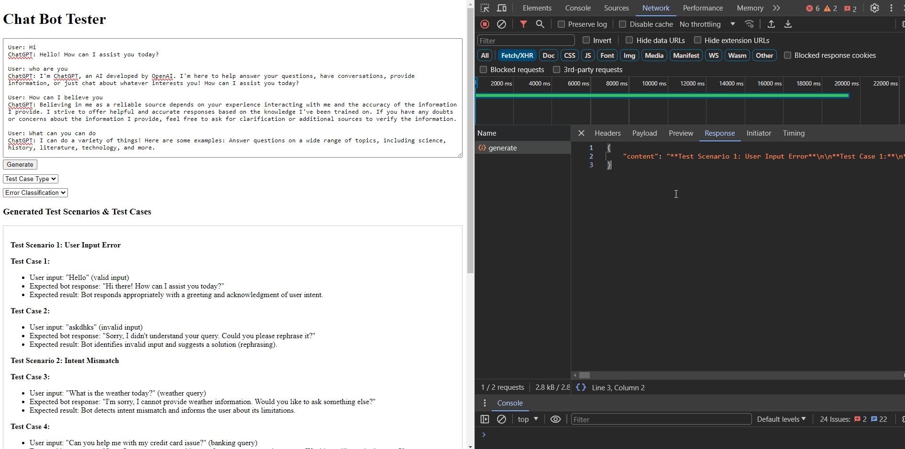

## Project Overview: 
Create an web app to design and execute comprehensive test cases for AI-powered, rule-based, and hybrid chatbots to identify errors and evaluate response accuracy for a given chat conversation.

## Technologies Used: 
Python, Vue.js, Flask

## Snapshots:
