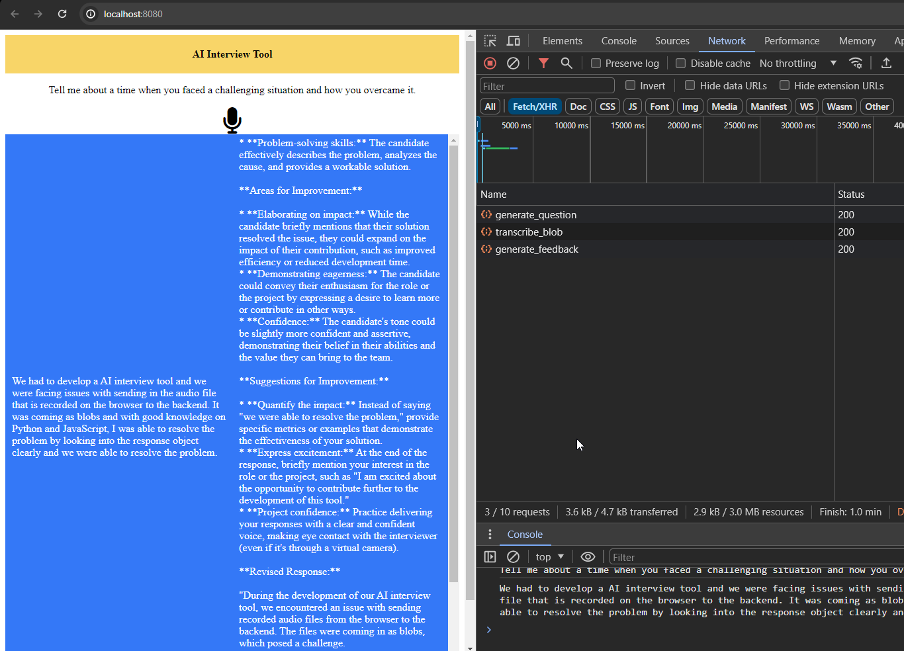
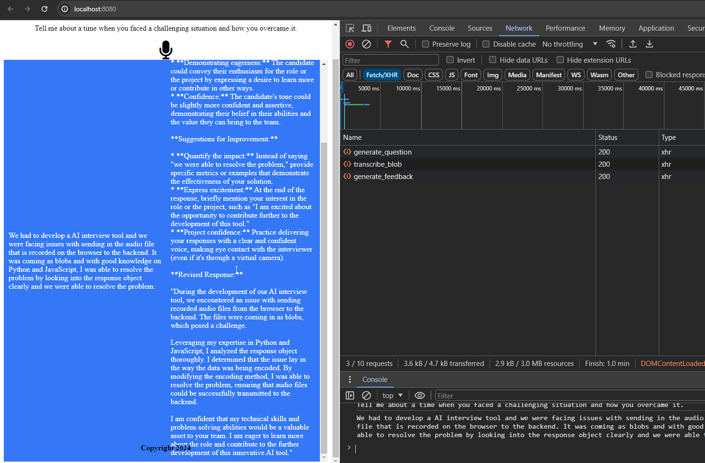

# AI Interview Preparation App




# Server

## Description

This project is a Vue.js/Python application designed to assist with preparing for interviews. 

It includes a transcription service and a content generation API.

This project is a Vue.js application that transcribes audio and sends the transcribed text to an API endpoint. The API returns feedback, which is then displayed in the application. The application has two main sections: one for displaying the transcribed text and another for displaying the feedback.

## Installation

### Prerequisites

- Python 3.10
- pip

### Steps

1. Clone the repository:

2. Navigate to the project directory:

```
cd server
```

3. Create a virtual environment:

```
python3 -m venv .venv
```

4. Activate the virtual environment:

```
source .venv/bin/activate
```

5. Install the required packages:

```
pip install -r requirements.txt
```

## Client

## Project setup

To set up the project, you need to install the project dependencies. You can do this by running the following command in your terminal:

```bash
npm install
## Project setup
```

### Compiles and hot-reloads for development
```
npm run serve
```

### Compiles and minifies for production
```
npm run build
```

### Lints and fixes files
```
npm run lint
```

### Customize configuration
See [Configuration Reference](https://cli.vuejs.org/config/).

## Usage

Provide instructions on how to use your tool.

## Testing

Explain how to run the automated tests for this system.

## Contributing

Provide instructions on how to contribute to this project.

## License

Include information about the license.