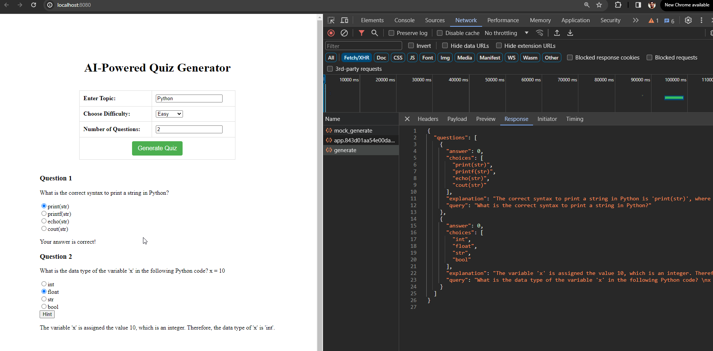

## Project Overview: 
Create an web app to develop an accurate and user-friendly multiple-choice quiz generator with quiz generation functionality, simplified UI elements, and basic quiz result tracking

## Technologies Used: 
Python, Vue.js, Flask

## Snapshots:
