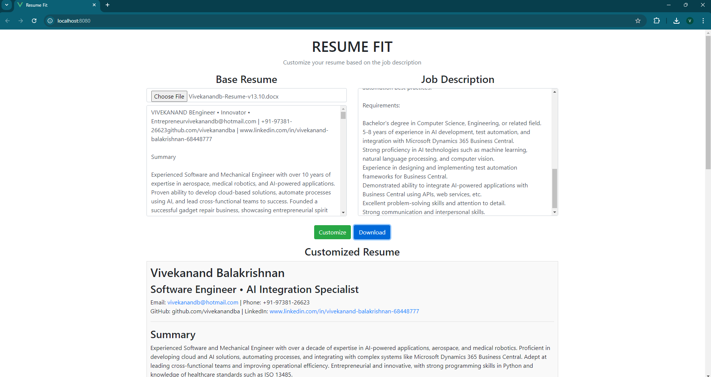

# Resume Fit

Resume Fit is a web application that allows users to customize their resumes based on a provided job description. Users can upload their existing resumes in PDF or DOCX format, provide a job description, and generate a customized resume. The application then allows downloading the customized resume as a PDF.

## Features

- Upload an existing resume in PDF or DOCX format
- Provide a job description for customization
- Generate a customized resume based on the job description
- Download the customized resume as a PDF
- Responsive design with Bootstrap for a better user experience

## Snapshots


## Technologies Used

- **Vue.js**: JavaScript framework for building the front-end interface
- **Flask**: Python web framework used for the back-end API
- **html2pdf.js**: Library for converting HTML content to a PDF file
- **Axios**: Library for making HTTP requests from the front-end
- **Bootstrap**: CSS framework for styling the application
- **pdfjs-dist**: Library for reading PDF files
- **mammoth.js**: Library for extracting text from DOCX files
- **Marked**: Library for rendering Markdown content

## Prerequisites

Make sure you have the following installed:

- **Node.js**: [Download and install Node.js](https://nodejs.org/)
- **npm**: Comes with Node.js, used for managing packages
- **Python**: [Download and install Python](https://www.python.org/)

## Getting Started

### 1. Clone the Repository

```bash
git clone https://github.com/gadjoy/projects.git
cd resume-fit
```

### 2. Set Up the Front-End

Navigate to the front-end directory and install dependencies:

```bash
cd client
npm install
```

### 3. Set Up the Back-End

Navigate to the back-end directory and set up the Flask server:

```bash
cd server
pip install -r requirements.txt
```

### 4. Running the Application

#### Running the Front-End

Navigate to the `client` directory and start the development server:

```bash
npm run serve
```

This will start the front-end on `http://localhost:8080`.

#### Running the Back-End

Navigate to the `server` directory and start the Flask server:

```bash
python app.py
```

The back-end server will be running on `http://localhost:5000`.

## Usage

1. **Upload Your Resume**: Click "Base Resume" and upload your existing resume in PDF or DOCX format.
2. **Enter Job Description**: In the "Job Description" section, provide the job description for the position you're applying for.
3. **Customize**: Click the "Customize" button to generate a customized resume.
4. **Download PDF**: Once the resume is customized, click "Download PDF" to download the customized resume.

## Project Structure

```
resume-fit/
├── client/                   # Vue.js front-end application
│   ├── public/               # Public assets and index.html
│   ├── src/                  # Vue components and main.js
│   ├── package.json          # Front-end dependencies
│   └── README.md             # Front-end specific documentation
├── server/                   # Flask back-end application
│   ├── app.py                # Main Flask server file
│   ├── requirements.txt      # Back-end dependencies
│   └── README.md             # Back-end specific documentation
└── README.md                 # Project documentation
```

## Dependencies

### Front-End Dependencies

- `axios`
- `html2pdf.js`
- `marked`
- `pdfjs-dist`
- `mammoth`

### Back-End Dependencies

- `Flask`

## Contributing

1. Fork the repository.
2. Create a new branch.
3. Make your changes.
4. Open a pull request.

## License

This project is licensed under the MIT License - see the [LICENSE](LICENSE) file for details.

## Acknowledgments

- [Vue.js](https://vuejs.org/)
- [Flask](https://flask.palletsprojects.com/)
- [Bootstrap](https://getbootstrap.com/)
- [html2pdf.js](https://ekoopmans.github.io/html2pdf.js/)
- [Marked](https://marked.js.org/)
- [pdfjs-dist](https://mozilla.github.io/pdf.js/)
- [mammoth.js](https://github.com/mwilliamson/mammoth.js)