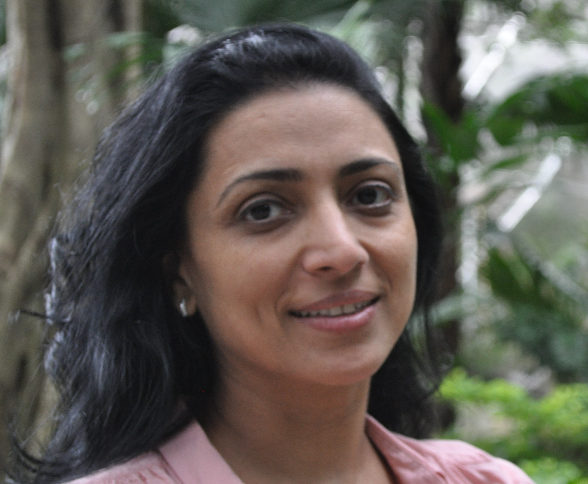

Priti started her career in art doing Henna Tattoo art and then ventured into the universe of painting. This progression was natural and was formalized with various art courses in both the United States and Holland. Her art has been deeply influenced by her cultural upbringing in India and then shaped with life experiences from living in the United States, Holland, Shanghai, and India, and visiting over 37 countries. Her paintings represent the blending of traditional and modern cultures and showcase both the free-flowing lines inspired by her Henna work as well as sharp geometrical discipline. Her art also manifests Priti’s love of creativity and experimentation, from paintings using simple acrylic on canvas, to mixes of oil, prints, charcoal, and pencil.