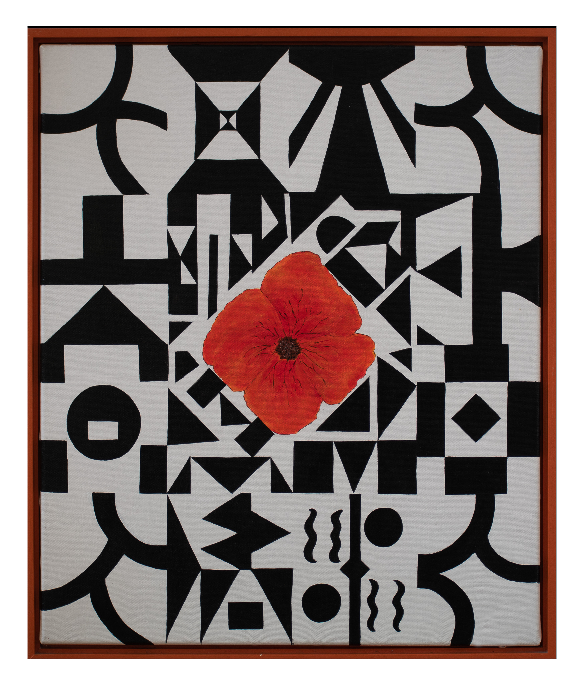

(50 cm X 60 cm)

While riding with my son on a bicycle to the Dutch nursery I used to see lots of vibrant Poppies growing along the canal. In this painting I wanted to contrast the red and orange hues of the flowers against slivers and shards of black on a primal white.